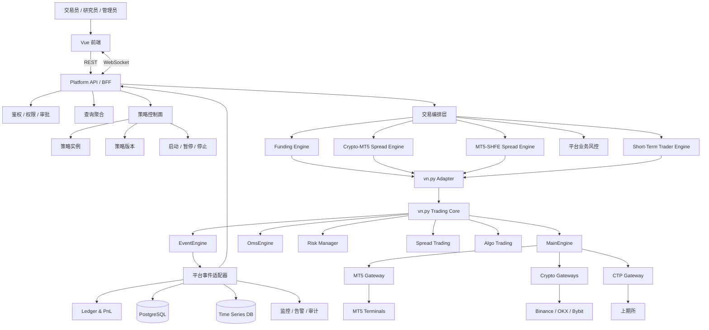
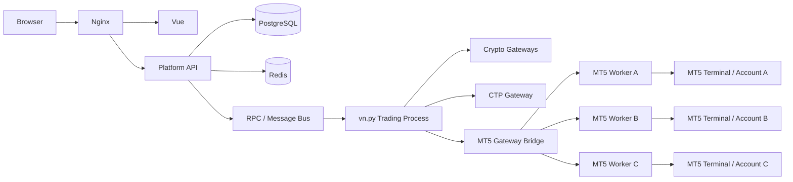
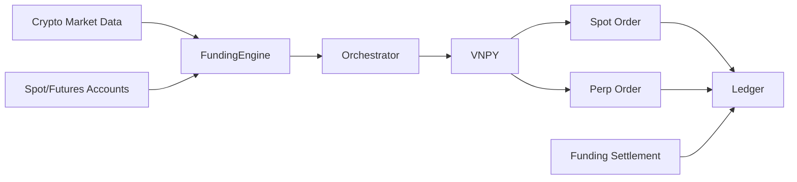
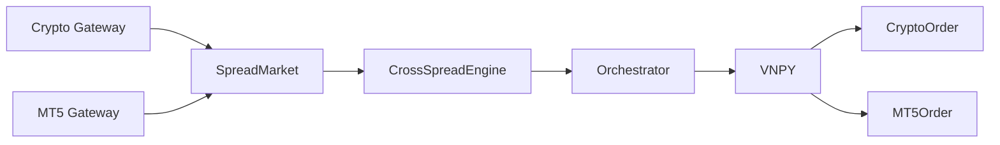
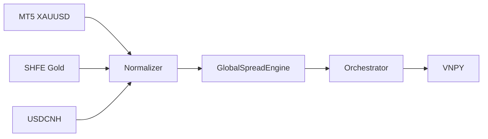
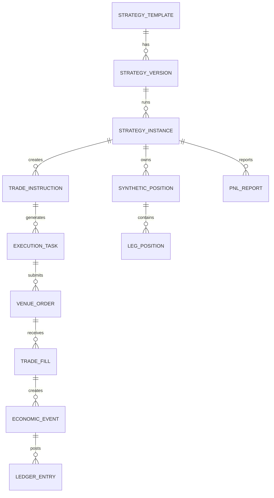

# Variable-Global 平台结合 vn.py 架构设计方案

> 适用项目：`wuxingyuenan5-lgtm/liuchengtu`  
> 当前前端目录：`admin-risk`  
> 文档版本：V2.1  
> 更新日期：2026-07-16  
> 文档定位：平台架构初步讨论稿  
> 当前暂定主线：**以现有 Variable-Global 产品框架为主，以 vn.py 为主交易内核；最终实施方式仍待评审确认**

---

> [!IMPORTANT]
> **文档状态：DRAFT / 初步讨论方案，尚未定稿。**  
> 本文仅用于架构讨论、需求梳理和后续评审，不代表已经确认的开发实施方案。  
> 在完成专项评审、技术验证和实施范围确认前，**不得直接据此开始生产级开发、数据迁移或实盘上线**。

当前仍需继续讨论并确认的事项包括：

- vn.py、Platform API、策略编排层和账本层的最终模块边界；
- MT5 Gateway 的底层实现方式、多账户进程模型和经纪商兼容性；
- Binance、OKX、Bybit 等加密 Gateway 的来源、维护责任和版本策略；
- Web 进程与交易进程之间采用 RPC、消息队列或其他通信方式；
- 数据库、时序数据、缓存、事件存储和部署拓扑；
- 订单、持仓、资金、对账、损益归因和会计口径；
- 权限、审批、Kill Switch、人工干预和审计规则；
- P0/P1/P2 的实施范围、人员安排、工期和验收标准。

---

# 1. 文档目标

本文档用于明确 Variable-Global 平台与 vn.py 的结合方式，并结合平台实际策略模块重新确定：

1. 前端、业务后端、策略服务和交易内核的边界；
2. vn.py 在平台中的具体定位；
3. MT5、主流加密交易所和上期所的接入优先级；
4. 各策略模块应依赖哪些 Gateway；
5. 哪些 vn.py 模块可以直接复用，哪些需要扩展；
6. 策略、指令、执行任务、订单、持仓和损益如何统一；
7. 平台应按什么顺序从当前前端工作台演进到真实交易系统。

本文中的“前端”不仅指视觉界面，也包括：

- 功能设计；
- 页面信息架构；
- 策略工作台；
- 操作流程；
- 风险提示；
- 权限和审批；
- 状态展示；
- 异常处理；
- 交易和损益穿透。

---

# 2. 平台真实策略模块

根据当前规划，平台策略模块固定为以下几类。

## 2.1 资金费率套利

交易范围：

```text
主流加密货币交易所
├─ Binance
├─ OKX
├─ Bybit
└─ 后续其他主流交易所
```

主要交易对象：

- 现货；
- USDT本位永续；
- 币本位永续；
- 后续可能涉及借币和杠杆账户。

该模块不依赖 MT5 和国内期货。

---

## 2.2 跨所价差

交易范围：

```text
主流加密交易所
        +
MT5
```

典型场景：

```text
XAUTUSDT.P
    -
XAUUSD
```

可能涉及：

- Bybit、Binance、OKX等加密交易所；
- Exness等MT5经纪商；
- USDT/USD换算；
- 盎司、合约张数和MT5手数换算；
- 双账户保证金；
- 两端残腿和网络风险。

---

## 2.3 海内外价差

交易范围：

```text
MT5
 +
上期所
```

典型场景：

- MT5 XAUUSD；
- 上期所沪金；
- 后续沪银和其他贵金属；
- 人民币、美元、USDCNH；
- 克、盎司、期货合约单位；
- 国内平今和平昨；
- 国内夜盘和涨跌停；
- 海外隔夜费。

---

## 2.4 两个短期交易员模块

主要交易范围：

```text
MT5
```

这两个模块应视为两个独立策略模板或策略团队，而不是两个独立交易系统。

每个短期交易员模块可以拥有：

- 独立策略版本；
- 独立账户；
- 独立仓位限制；
- 独立交易时段；
- 独立风险规则；
- 独立订单和损益；
- 独立策略实例。

---

# 3. 策略与Gateway依赖矩阵

| 策略模块 | 加密Gateway | MT5 Gateway | CTP/上期所Gateway | 主要执行模式 |
|---|---:|---:|---:|---|
| 资金费率套利 | 核心依赖 | 不依赖 | 不依赖 | 现货+永续多腿 |
| 跨所价差 | 核心依赖 | 核心依赖 | 不依赖 | 加密+MT5双腿 |
| 海内外价差 | 不依赖 | 核心依赖 | 核心依赖 | MT5+国内期货双腿 |
| 短期交易员A | 不依赖 | 核心依赖 | 不依赖 | MT5单腿/组合 |
| 短期交易员B | 不依赖 | 核心依赖 | 不依赖 | MT5单腿/组合 |

由此得到Gateway重要性排序：

```text
第一核心：MT5 Gateway
第二核心：Crypto Gateway
第三核心：CTP / 上期所 Gateway
```

原因：

- MT5同时服务跨所价差、海内外价差和两个短期交易员；
- 加密Gateway服务资金费率套利和跨所价差；
- CTP主要服务海内外价差。

---

# 4. 最终架构决策

## 4.1 主架构

```text
现有 Vue 前端
        +
Platform API / BFF
        +
策略与交易编排层
        +
vn.py 主交易内核
        +
自建账本、损益和数据平台
```

## 4.2 唯一主交易内核

平台不并行建设第二套完整交易内核。

统一使用 vn.py 承载：

- EventEngine；
- MainEngine；
- Gateway；
- OMS；
- OrderData；
- TradeData；
- PositionData；
- AccountData；
- 基础风控；
- 基础算法；
- 基础价差。

NautilusTrader、Freqtrade、rotki、aiomql和PyTrader仅作为不同层面的参考或底层组件候选。

## 4.3 各项目定位

| 项目 | 最终定位 | 是否进入核心运行时 |
|---|---|---:|
| Variable-Global原框架 | 产品和业务主框架 | 是 |
| vn.py | 唯一主交易内核 | 是 |
| vn.py Spread Trading | 多腿和价差基础 | 是，扩展后使用 |
| vn.py Risk Manager | 底层订单风控 | 是 |
| vn.py RPC Service | 交易进程通信 | 可选 |
| aiomql | MT5 Gateway底层客户端候选 | 可选 |
| PyTrader | MT4或远程EA桥接备用 | 备用 |
| NautilusTrader | 状态机、DDD、恢复和可靠性参考 | 否 |
| Freqtrade | 策略实例运营和Web控制参考 | 否 |
| rotki | 账本和PnL架构参考 | 否 |

---

# 5. 六项核心原则

## 5.1 现有一级产品框架保持不变

```text
交易平台
├─ 行情分析
└─ 交易执行

策略管理
├─ 策略损益
├─ 账户资金
└─ 订单信息
```

策略模块通过页面页签或策略工作台区分，不改变一级导航。

## 5.2 vn.py只负责交易基础设施

vn.py不是：

- 最终Web前端；
- 策略审批系统；
- 基金管理平台；
- 复杂损益账本；
- 多账户运营平台。

## 5.3 平台只有一套状态和业务真相

不能同时存在：

- vn.py订单状态；
- MT5自定义订单状态；
- Freqtrade Trade状态；
- 前端本地模拟状态。

统一由平台对象描述，vn.py对象只是底层输入。

## 5.4 Gateway只是执行端口

MT5、Bybit、OKX、Binance和CTP都只是Gateway。

```text
Strategy Orchestrator
        ↓
vn.py MainEngine
        ↓
Gateway
        ↓
外部交易系统
```

## 5.5 OMS不是永久账本

vn.py OMS负责当前运行状态。

数据库负责：

- 历史订单；
- 历史成交；
- 资金流；
- 费用；
- 资金费；
- 损益；
- 对账；
- 审计。

## 5.6 Web与交易进程隔离

```text
浏览器
  ↓
Platform API
  ↓
RPC / Message Bridge
  ↓
vn.py交易进程
  ↓
Gateway
```

关闭浏览器不能影响策略运行。

---

# 6. 目标总体架构



---

# 7. 部署架构

第一阶段采用：

```text
模块化单体业务后端
+
独立vn.py交易进程
+
独立MT5 Worker
+
独立数据库
```



## 7.1 MT5多账户原则

建议：

```text
一个MT5账户
=
一个MT5终端实例
+
一个独立Worker
+
一个独立Gateway连接标识
```

理由：

- 避免账户切换；
- 避免全局MetaTrader5连接冲突；
- 故障隔离；
- 日志隔离；
- 策略和Magic Number隔离；
- 单账户重启不影响其他账户。

---

# 8. 前端层职责

前端负责：

- 行情分析；
- 策略工作台；
- 交易指令；
- 参数录入；
- 风险检查展示；
- 审批和确认；
- 执行进度；
- 订单和成交；
- 腿仓和合成仓位；
- 策略启停；
- 损益和账户；
- 人工干预；
- 告警；
- 审计查看。

前端不负责：

- 交易所连接；
- 最终数量合法性；
- 订单成交判断；
- 持仓本地修改；
- 交易密钥；
- 以setTimeout模拟成交；
- 以页面状态作为订单真相。

---

# 9. 后端分层

## 9.1 Platform API / BFF

负责：

- 登录；
- 权限；
- 审批；
- DTO；
- REST；
- WebSocket；
- 参数校验；
- 幂等；
- 查询聚合；
- 操作审计；
- API版本。

## 9.2 策略控制面

吸收Freqtrade的运营思想，负责：

- 策略模板；
- 策略版本；
- 策略实例；
- PAPER / LIVE；
- 启动；
- 暂停；
- 禁止新开仓；
- 恢复；
- 有序停止；
- 强制退出；
- 心跳；
- 日志；
- 配置版本。

## 9.3 交易编排层

负责：

- 交易指令；
- 执行任务；
- 多腿配平；
- 主动腿；
- 被动腿；
- 执行前检查；
- 部分成交；
- 残腿；
- 对冲；
- 超时；
- 人工干预；
- 紧急平仓；
- 结果回写。

## 9.4 vn.py交易内核

负责：

- Gateway；
- 行情；
- 合约；
- 账户；
- 持仓；
- 委托；
- 撤单；
- 成交；
- 实时OMS；
- 底层风控；
- 基础算法。

## 9.5 Ledger与PnL

负责：

- EconomicEvent；
- LedgerEntry；
- 归因；
- 估值；
- 缺失数据；
- 报告版本；
- 数据完整度。

---

# 10. Gateway架构

# 10.1 Crypto Gateway

服务：

- 资金费率套利；
- 跨所价差。

优先接入：

```text
Bybit
Binance
OKX
```

需要支持：

- Spot；
- USDT永续；
- 币本位永续；
- Funding Rate；
- Mark Price；
- Index Price；
- Order Book；
- Position Mode；
- Reduce Only；
- Post Only；
- IOC/FOK；
- 资金账户；
- 统一账户；
- 现货和合约余额；
- 资金划转。

由于官方vn.py核心不再完整维护加密接口，可采用：

1. VeighNa Evo或成熟社区Gateway；
2. Fork后自行维护；
3. 后续关键交易所自研Gateway。

所有Gateway必须通过统一验收。

---

# 10.2 MT5 Gateway

MT5是平台最关键Gateway。

服务：

- 跨所价差；
- 海内外价差；
- 短期交易员A；
- 短期交易员B。

推荐结构：

```text
vnpy_mt5/
├─ gateway.py
├─ client.py
├─ mapper.py
├─ quote_poller.py
├─ order_tracker.py
├─ position_tracker.py
├─ reconciliation.py
├─ recovery.py
├─ account_worker.py
├─ constants.py
└─ tests/
```

底层客户端选择顺序：

```text
第一选择：官方MetaTrader5 Python包
第二选择：aiomql低层封装
第三选择：PyTrader备用桥接
```

不使用aiomql的：

- Strategy；
- Bot；
- Trader；
- RAM；
- SQLite账本。

MT5 Gateway需要处理：

- Symbol后缀；
- Contract Size；
- Tick Size；
- Tick Value；
- 最小手数；
- 手数步进；
- Filling Mode；
- Hedging；
- Netting；
- Market Execution；
- Instant Execution；
- Pending Order；
- SL/TP；
- Magic Number；
- 部分平仓；
- 手工订单；
- 隔夜费；
- 交易时间；
- 终端重连；
- Ticket映射。

---

# 10.3 CTP / 上期所Gateway

服务：

- 海内外价差。

优先采用vn.py官方或成熟CTP Gateway。

必须处理：

- 上期所合约；
- 平今；
- 平昨；
- 涨跌停；
- 夜盘；
- 节假日；
- 合约换月；
- 保证金；
- 手续费；
- 国内账户；
- 结算数据；
- 交易日和自然日差异。

---

# 11. vn.py模块采用矩阵

| 模块 | 采用方式 | 用途 |
|---|---|---|
| `vnpy.event` | 直接采用 | 内部事件总线 |
| `MainEngine` | 封装采用 | Gateway与Engine调度 |
| `BaseGateway` | 标准接口 | 所有交易端统一 |
| `OmsEngine` | 直接采用 | 实时订单、成交、持仓和账户 |
| `vnpy_riskmanager` | 直接采用并扩展 | 底层订单风控 |
| `vnpy_spreadtrading` | 部分复用 | Leg、Spread和多腿基础 |
| `vnpy_algotrading` | 选择性复用 | TWAP、Sniper、Iceberg |
| `vnpy_rpcservice` | 推荐 | Web进程与交易进程通信 |
| `vnpy_datarecorder` | 选择性复用 | Tick和K线录制 |
| PySide UI | 不采用 | 保留现有Vue前端 |
| vnpy.alpha | 暂不采用 | 当前重点不是因子研究 |

---

# 12. 策略模块架构

# 12.1 资金费率套利



vn.py负责：

- 交易所连接；
- 行情；
- 账户；
- 现货订单；
- 永续订单；
- 持仓；
- 基础风控。

FundingStrategyEngine负责：

- 资金费率日历；
- 预计费率；
- 实际费率；
- 现货永续配平；
- 多交易所比较；
- 资金划转；
- 移仓；
- 借贷；
- 负费率退出；
- 结算保护。

损益：

```text
累计总损益
├─ 资金费收益
├─ 基差损益
├─ 交易成本
├─ 借贷成本
├─ 划转费用
└─ 其他调整
```

---

# 12.2 跨所价差



核心模型：

```text
SyntheticSpread
├─ CryptoLeg
├─ MT5Leg
├─ PriceFormula
├─ QuantityFormula
├─ ActiveLeg
├─ PassiveLeg
├─ TargetVolume
├─ FilledVolume
├─ ResidualExposure
└─ ExecutionState
```

必须处理：

- USDT/USD；
- 盎司和MT5 lot；
- 交易所张数；
- 两端深度；
- 两端延迟；
- 双账户保证金；
- 残腿；
- 网络故障；
- 单边爆仓距离。

残腿策略：

```text
CONTINUE_HEDGE
MARKET_HEDGE
ROLLBACK_ACTIVE_LEG
PAUSE_AND_ALERT
MANUAL_INTERVENTION
EMERGENCY_CLOSE
```

---

# 12.3 海内外价差



MarketNormalizer负责：

- 美元金价；
- 人民币金价；
- USDCNH；
- 克/盎司；
- 合约乘数；
- MT5 lot；
- 手续费；
- 隔夜费；
- 国内交易时段；
- 海外交易时段。

损益归因：

```text
累计总损益
├─ 累计损益（除汇率）
│  ├─ 库存费累计收益（除汇率）
│  ├─ 海内外溢价损益
│  ├─ 期现价差损益
│  └─ 累计交易成本
├─ 汇率损益
│  ├─ 海外本金汇率损益
│  ├─ 库存费汇率损益
│  ├─ 国内汇率变动持仓损益
│  ├─ 海外持仓汇率损益
│  └─ 国内对冲持仓汇率损益
└─ 配平误差
   ├─ 海外持仓损益（除汇率）
   └─ 国内对冲持仓损益（除汇率）
```

---

# 12.4 短期交易员A和B

两个交易员模块统一使用同一套短期策略框架：

```text
ShortTermTraderTemplate
├─ Trader A Instance
└─ Trader B Instance
```

每个实例配置：

- MT5账户；
- 交易品种；
- 策略版本；
- 交易时段；
- 最大仓位；
- 单笔风险；
- 日内亏损；
- 最大回撤；
- 允许订单类型；
- 是否允许隔夜；
- Magic Number；
- 策略标签。

统一能力：

- 手工交易指令；
- 半自动交易；
- 自动策略；
- 限价单；
- 市价单；
- Stop；
- Stop Limit；
- SL/TP；
- 移动止损；
- 部分平仓；
- 全平；
- 禁止新开仓；
- Kill Switch。

两个交易员不得各自维护一套MT5连接和订单数据库，而应共享平台Gateway和订单模型。

---

# 13. 前端信息架构

## 13.1 一级结构

```text
交易平台
├─ 资金费率套利
│  ├─ 行情分析
│  └─ 交易执行
├─ 跨所价差
│  ├─ 行情分析
│  └─ 交易执行
├─ 海内外价差
│  ├─ 行情分析
│  └─ 交易执行
├─ 短期交易员A
│  ├─ 行情分析
│  └─ 交易执行
└─ 短期交易员B
   ├─ 行情分析
   └─ 交易执行

策略管理
├─ 策略损益
├─ 账户资金
└─ 订单信息
```

## 13.2 前端Store

```text
stores/
├─ gatewayStore
├─ marketStore
├─ accountStore
├─ contractStore
├─ strategyStore
├─ instructionStore
├─ executionStore
├─ orderStore
├─ tradeStore
├─ positionStore
├─ spreadStore
├─ riskStore
├─ ledgerStore
└─ notificationStore
```

## 13.3 Gateway状态栏

统一显示：

- Gateway名称；
- 行情连接；
- 交易连接；
- 最后心跳；
- 延迟；
- 行情新鲜度；
- 账户同步时间；
- 重连次数；
- 当前权限；
- 风险状态；
- 终端状态；
- 服务器时间偏差。

---

# 14. 策略控制面

策略实例表：

| 字段 | 示例 |
|---|---|
| 策略实例 | CROSS_GOLD_001 |
| 策略模板 | XAUT-XAUUSD |
| 策略版本 | v1.3 |
| 环境 | PAPER/LIVE |
| 状态 | RUNNING |
| 允许开仓 | 是 |
| Gateway | BYBIT + MT5 |
| 账户 | Crypto-01 + MT5-02 |
| 当前持仓 | 数值 |
| 今日损益 | 数值 |
| 当前回撤 | 数值 |
| 风控状态 | 正常 |
| 最近心跳 | 时间 |

操作：

```text
启动
暂停
禁止新开仓
恢复
有序停止
全部撤单
强制平仓
查看日志
查看版本
查看配置
```

---

# 15. 核心领域模型



统一对象：

```text
Gateway
Account
Instrument
StrategyTemplate
StrategyVersion
StrategyInstance
TradeInstruction
ExecutionTask
VenueOrder
TradeFill
LegPosition
SyntheticPosition
RiskCheck
EconomicEvent
LedgerEntry
PnLReport
```

---

# 16. 状态机

## 16.1 Gateway和组件状态

```text
PRE_INITIALIZED
READY
STARTING
RUNNING
DEGRADING
DEGRADED
STOPPING
STOPPED
FAULTING
FAULTED
RECOVERING
DISPOSED
```

## 16.2 策略实例状态

```text
DRAFT
READY
STARTING
RUNNING
PAUSED
STOP_ENTRY
RISK_FROZEN
STOPPING
STOPPED
FAULTED
RECOVERING
```

## 16.3 交易指令状态

```text
DRAFT
PENDING_APPROVAL
REJECTED
RISK_CHECKING
RISK_REJECTED
ACCEPTED
EXECUTING
PARTIALLY_COMPLETED
HEDGING
COMPLETED
CANCELLING
CANCELLED
MANUAL_INTERVENTION
FAILED
FROZEN
```

## 16.4 多腿执行状态

```text
WAITING_TRIGGER
CHECKING_MARKET
SUBMITTING_ACTIVE_LEG
ACTIVE_LEG_PARTIAL
HEDGING_PASSIVE_LEG
PASSIVE_LEG_PARTIAL
BALANCED
REPRICING
TIMEOUT
RESIDUAL_EXPOSURE
EMERGENCY_HEDGE
MANUAL_INTERVENTION
FINISHED
FAILED
CANCELLED
```

## 16.5 底层订单状态

```text
SUBMITTING
NOT_TRADED
PART_TRADED
ALL_TRADED
CANCELLING
CANCELLED
REJECTED
UNKNOWN
```

---

# 17. vn.py对象映射

| vn.py对象 | 平台对象 | 额外字段 |
|---|---|---|
| TickData | MarketQuote | 延迟、数据源、新鲜度 |
| ContractData | Instrument | 标准化品种、报价币、乘数 |
| AccountData | AccountSnapshot | 风险和策略可用资金 |
| PositionData | LegPosition | 策略实例和账户归属 |
| OrderData | VenueOrder | 指令、任务、腿、幂等 |
| TradeData | TradeFill | 手续费、流动性角色 |
| SpreadData | SyntheticMarket | 汇率、单位和双端延迟 |

平台订单额外字段：

```text
strategyInstanceId
instructionId
executionTaskId
legId
accountId
venue
gateway
clientOrderId
idempotencyKey
riskCheckId
approvalId
operatorId
submitLatency
exchangeLatency
rejectCode
rejectReason
```

---

# 18. API与事件

## 18.1 策略控制

```http
POST /api/v1/strategy-instances/{id}/start
POST /api/v1/strategy-instances/{id}/pause
POST /api/v1/strategy-instances/{id}/resume
POST /api/v1/strategy-instances/{id}/stop-entry
POST /api/v1/strategy-instances/{id}/stop
```

## 18.2 交易命令

```http
POST /api/v1/trade-instructions
POST /api/v1/trade-instructions/{id}/submit
POST /api/v1/trade-instructions/{id}/approve
POST /api/v1/trade-instructions/{id}/execute
POST /api/v1/trade-instructions/{id}/cancel
POST /api/v1/trade-instructions/{id}/emergency-hedge
POST /api/v1/orders/{id}/cancel
POST /api/v1/positions/{id}/close
POST /api/v1/positions/close-all
```

## 18.3 查询

```http
GET /api/v1/gateways
GET /api/v1/accounts
GET /api/v1/contracts
GET /api/v1/strategy-instances
GET /api/v1/trade-instructions
GET /api/v1/execution-tasks
GET /api/v1/orders
GET /api/v1/trades
GET /api/v1/positions
GET /api/v1/spread-positions
GET /api/v1/risk-events
GET /api/v1/ledger-entries
GET /api/v1/pnl-reports
```

## 18.4 WebSocket事件

```text
gateway.status.changed
market.tick.updated
market.spread.updated
account.updated
position.updated
spread_position.updated
strategy_instance.updated
instruction.status.changed
execution_task.updated
order.updated
trade.created
risk.order.rejected
risk.alert.created
economic_event.created
ledger.entry.created
pnl.updated
```

---

# 19. 风控架构

## 19.1 vn.py底层风控

- 合约合法；
- 价格合法；
- 数量合法；
- 单笔上限；
- 活动委托上限；
- 重复下单；
- 报撤单限制；
- 基础订单规则。

## 19.2 平台业务风控

### 资金费率套利

- 单交易所敞口；
- 单币种敞口；
- 资金费率反转；
- 借贷成本；
- 保证金；
- 强平距离；
- 双腿配平；
- 结算窗口。

### 跨所价差

- Crypto-MT5残腿；
- 双端延迟；
- USDT/USD；
- 双账户资金；
- 裸露时间；
- 裸露市值；
- MT5爆仓距离。

### 海内外价差

- MT5-SHFE残腿；
- 汇率；
- 国内涨跌停；
- 平今和平昨；
- 夜盘；
- 国内外交易时段错位；
- 期货保证金；
- 海外隔夜费。

### 短期交易员

- 单笔风险；
- 最大持仓；
- 日内亏损；
- 最大回撤；
- 禁止时段；
- 最大连续亏损；
- 隔夜限制；
- 新闻或异常波动限制。

## 19.3 Kill Switch

- 策略级；
- 账户级；
- Gateway级；
- 禁止新开仓；
- 仅允许平仓；
- 全部撤单；
- 全部平仓；
- 紧急对冲；
- 全平台停止。

---

# 20. 账本和PnL

处理链路：

```text
订单 / 成交 / 资金费 / 隔夜费 / 借贷费 / 汇率
    ↓
EconomicEvent
    ↓
LedgerEntry
    ↓
AccountingRule
    ↓
PnLAttribution
    ↓
PnLReport
```

账本类型：

```text
TRADE_LEDGER
FUNDING_LEDGER
BORROWING_LEDGER
OVERNIGHT_FEE_LEDGER
FEE_LEDGER
FX_LEDGER
TRANSFER_LEDGER
POSITION_LEDGER
VALUATION_LEDGER
ADJUSTMENT_LEDGER
```

缺失数据：

```text
MISSING_MARK_PRICE
MISSING_FX_RATE
MISSING_FUNDING_SETTLEMENT
MISSING_BORROW_RATE
MISSING_OVERNIGHT_FEE
MISSING_TRADING_FEE
UNMATCHED_TRADE
UNMATCHED_TRANSFER
```

---

# 21. 可靠性和恢复

## 21.1 幂等

每个交易命令包含：

```text
idempotencyKey
clientRequestId
operatorId
correlationId
```

## 21.2 启动恢复

1. 启动vn.py；
2. 注册Gateway；
3. 连接交易端；
4. 查询合约；
5. 查询账户；
6. 查询持仓；
7. 查询活动订单；
8. 对账数据库；
9. 恢复未完成任务；
10. 检查残腿；
11. 恢复订阅；
12. 输出恢复报告；
13. 一致后进入READY。

## 21.3 定时对账

- 订单；
- 成交；
- 持仓；
- 账户；
- 资金费；
- 隔夜费；
- 借贷；
- 资金划转；
- 合成持仓；
- 策略损益。

---

# 22. 数据存储

## PostgreSQL

- 用户和权限；
- Gateway配置；
- 账户；
- 策略模板和版本；
- 策略实例；
- 指令；
- 执行任务；
- 订单；
- 成交；
- 持仓快照；
- 风控；
- 审计；
- 经济事件；
- 账本；
- PnL报告。

## 时序数据库

- Tick；
- K线；
- Funding；
- Basis；
- Spread；
- 净值；
- 风险；
- 延迟；
- Gateway健康度。

## Redis

- WebSocket会话；
- 最新行情；
- 缓存；
- 幂等键；
- 分布式锁；
- 实时任务；
- 告警。

---

# 23. 推荐代码目录

```text
liuchengtu/
├─ admin-risk/
├─ services/
│  ├─ platform-api/
│  ├─ strategy-control/
│  ├─ strategy-orchestrator/
│  │  ├─ funding/
│  │  ├─ cross-exchange/
│  │  ├─ global-spread/
│  │  └─ short-term-trader/
│  ├─ vnpy-trading-core/
│  │  ├─ app/
│  │  │  ├─ main.py
│  │  │  ├─ engines/
│  │  │  ├─ gateways/
│  │  │  │  ├─ crypto/
│  │  │  │  ├─ mt5/
│  │  │  │  └─ ctp/
│  │  │  ├─ risk/
│  │  │  ├─ spread/
│  │  │  ├─ algo/
│  │  │  ├─ recovery/
│  │  │  ├─ reconciliation/
│  │  │  └─ events/
│  │  └─ tests/
│  ├─ ledger-pnl/
│  └─ data-service/
├─ packages/
│  ├─ contracts/
│  └─ domain-models/
├─ deploy/
└─ docs/
```

---

# 24. 实施优先级

根据策略依赖，不再按普通“先加密、再MT5”的顺序，而按平台复用价值排序。

## 阶段0：统一模型和接口

完成：

- 策略模板；
- 策略版本；
- 策略实例；
- 指令；
- 执行任务；
- 订单；
- 成交；
- 持仓；
- 状态机；
- API；
- WebSocket事件；
- 幂等。

## 阶段1：MT5 Gateway

这是最高优先级。

完成：

- MT5行情；
- 合约；
- 账户；
- 持仓；
- 订单；
- 成交；
- Pending Order；
- SL/TP；
- 部分平仓；
- Magic Number；
- 多账户Worker；
- 重连；
- 对账；
- 恢复。

先接Demo账户。

## 阶段2：Crypto Gateway

完成：

- Bybit；
- Binance；
- OKX；
- Spot；
- Perpetual；
- Funding；
- Mark Price；
- Position；
- Account；
- Order；
- Transfer。

## 阶段3：短期交易员A/B

优先落地原因：

- 只依赖MT5；
- 执行链路相对简单；
- 可以验证订单、持仓、风控和PnL全链路。

先做：

```text
前端指令
→ 平台风控
→ vn.py
→ MT5 Gateway
→ 订单回报
→ 成交
→ 持仓
→ PnL
```

## 阶段4：跨所价差

打通：

```text
Crypto Gateway
+
MT5 Gateway
+
多腿编排
+
残腿风险
```

## 阶段5：资金费率套利

打通：

- 现货；
- 永续；
- Funding；
- 配平；
- 资金划转；
- Funding Ledger。

## 阶段6：CTP和海内外价差

完成：

- CTP；
- 上期所；
- 国内合约；
- MT5-SHFE；
- 汇率；
- 国内外时间；
- 海内外黄金归因。

## 阶段7：生产强化

- 权限；
- 审批；
- 高可用；
- 灾备；
- 自动对账；
- 告警；
- 审计；
- 多账户；
- 多策略实例；
- 策略版本管理。

---

# 25. Gateway验收标准

所有Gateway必须通过统一测试。

## 25.1 通用测试

- 72小时连续运行；
- 网络断开恢复；
- 进程重启恢复；
- 活动订单恢复；
- 持仓恢复；
- 重复命令不重复下单；
- 部分成交；
- 撤单；
- 拒单；
- 行情延迟；
- 订单延迟；
- 账户对账；
- 持仓对账；
- 手工订单识别；
- 日志完整；
- 指标完整。

## 25.2 MT5专项

- Symbol后缀；
- Hedging；
- Netting；
- Filling Mode；
- Market Execution；
- Pending Order；
- 部分平仓；
- SL/TP；
- Magic Number；
- 终端关闭；
- 经纪商维护；
- 多终端；
- 隔夜费。

## 25.3 Crypto专项

- Spot和Perpetual；
- One-way和Hedge Mode；
- Reduce Only；
- Post Only；
- Funding；
- Mark Price；
- Index Price；
- API限频；
- WebSocket断线；
- 统一账户；
- 资金划转；
- 交易所维护。

## 25.4 CTP专项

- 平今；
- 平昨；
- 夜盘；
- 交易日切换；
- 涨跌停；
- 合约换月；
- 结算确认；
- 断线重连；
- 查询限频。

---

# 26. 最终架构定位

```text
Variable-Global
=
产品、策略、执行编排、风控、资金、损益和管理平台

vn.py
=
统一交易内核

MT5 / Crypto / CTP
=
统一Gateway执行端
```

四类策略模块分别为：

```text
资金费率套利
= Crypto Gateway

跨所价差
= Crypto Gateway + MT5 Gateway

海内外价差
= MT5 Gateway + CTP Gateway

短期交易员A/B
= MT5 Gateway
```

最终平台必须做到：

- 所有策略共用一套Gateway体系；
- 所有策略共用一套订单和成交模型；
- 所有策略共用一套风控框架；
- 所有策略共用一套账本；
- 所有策略共用一套前端状态；
- MT5、加密和上期所只负责执行，不决定平台业务状态。

最终结论：

> **以现有Vue平台作为产品和管理中枢，以vn.py作为唯一交易内核，优先建设MT5 Gateway和Crypto Gateway，再接入CTP；资金费率套利、跨所价差、海内外价差和两个短期交易员全部通过统一策略编排层使用同一套订单、持仓、风险和账本体系。**